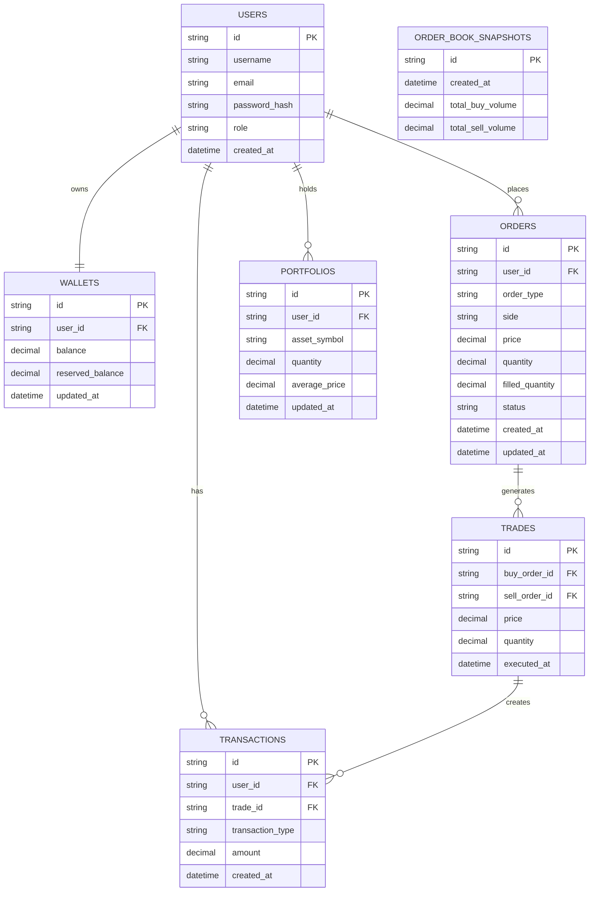

# TradeCore — ER Diagram

```mermaid
erDiagram

    USERS {
        string id PK
        string username
        string email
        string password_hash
        string role
        datetime created_at
    }

    WALLETS {
        string id PK
        string user_id FK
        decimal balance
        decimal reserved_balance
        datetime updated_at
    }

    ORDERS {
        string id PK
        string user_id FK
        string order_type
        string side
        decimal price
        decimal quantity
        decimal filled_quantity
        string status
        datetime created_at
        datetime updated_at
    }

    TRADES {
        string id PK
        string buy_order_id FK
        string sell_order_id FK
        decimal price
        decimal quantity
        datetime executed_at
    }

    PORTFOLIOS {
        string id PK
        string user_id FK
        string asset_symbol
        decimal quantity
        decimal average_price
        datetime updated_at
    }

    TRANSACTIONS {
        string id PK
        string user_id FK
        string trade_id FK
        string transaction_type
        decimal amount
        datetime created_at
    }

    ORDER_BOOK_SNAPSHOTS {
        string id PK
        datetime created_at
        decimal total_buy_volume
        decimal total_sell_volume
    }

    USERS ||--|| WALLETS : owns
    USERS ||--o{ ORDERS : places
    USERS ||--o{ PORTFOLIOS : holds
    USERS ||--o{ TRANSACTIONS : has

    ORDERS ||--o{ TRADES : generates
    TRADES ||--o{ TRANSACTIONS : creates
```
