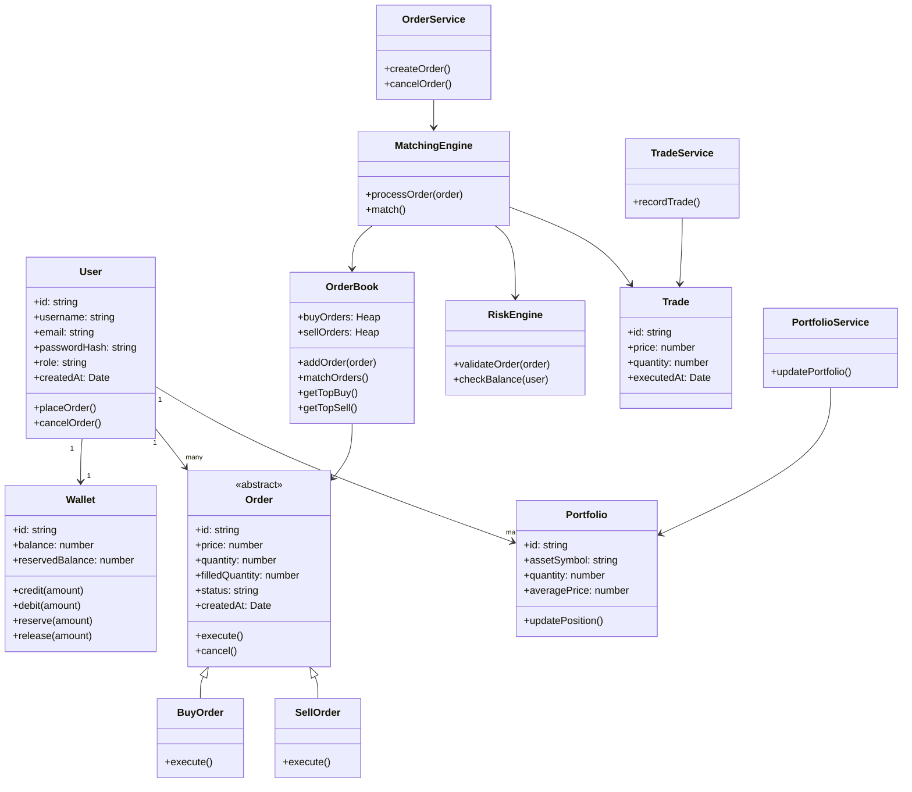

# TradeCore — Class Diagram

```mermaid
classDiagram

%% =========================
%% Core Domain Classes
%% =========================

class User {
    +id: string
    +username: string
    +email: string
    +passwordHash: string
    +role: string
    +createdAt: Date
    +placeOrder()
    +cancelOrder()
}

class Wallet {
    +id: string
    +balance: number
    +reservedBalance: number
    +credit(amount)
    +debit(amount)
    +reserve(amount)
    +release(amount)
}

class Order {
    <<abstract>>
    +id: string
    +price: number
    +quantity: number
    +filledQuantity: number
    +status: string
    +createdAt: Date
    +execute()
    +cancel()
}

class BuyOrder {
    +execute()
}

class SellOrder {
    +execute()
}

class Trade {
    +id: string
    +price: number
    +quantity: number
    +executedAt: Date
}

class Portfolio {
    +id: string
    +assetSymbol: string
    +quantity: number
    +averagePrice: number
    +updatePosition()
}

%% =========================
%% Matching Engine
%% =========================

class OrderBook {
    +buyOrders: Heap
    +sellOrders: Heap
    +addOrder(order)
    +matchOrders()
    +getTopBuy()
    +getTopSell()
}

class MatchingEngine {
    +processOrder(order)
    +match()
}

class RiskEngine {
    +validateOrder(order)
    +checkBalance(user)
}

%% =========================
%% Services
%% =========================

class OrderService {
    +createOrder()
    +cancelOrder()
}

class TradeService {
    +recordTrade()
}

class PortfolioService {
    +updatePortfolio()
}

%% =========================
%% Relationships
%% =========================

User "1" --> "1" Wallet
User "1" --> "many" Order
User "1" --> "many" Portfolio

Order <|-- BuyOrder
Order <|-- SellOrder

OrderBook --> Order
MatchingEngine --> OrderBook
MatchingEngine --> RiskEngine
MatchingEngine --> Trade

OrderService --> MatchingEngine
TradeService --> Trade
PortfolioService --> Portfolio
```
