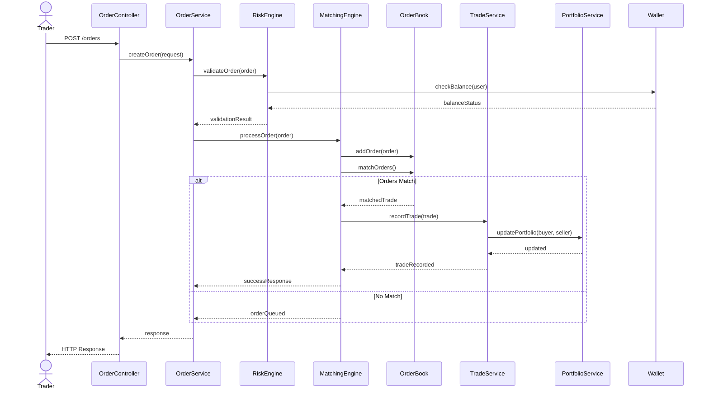

# TradeCore — Sequence Diagram

```mermaid
sequenceDiagram

actor Trader
participant OrderController
participant OrderService
participant RiskEngine
participant MatchingEngine
participant OrderBook
participant TradeService
participant PortfolioService
participant Wallet

%% Trader places order
Trader ->> OrderController: POST /orders
OrderController ->> OrderService: createOrder(request)

%% Risk validation
OrderService ->> RiskEngine: validateOrder(order)
RiskEngine ->> Wallet: checkBalance(user)
Wallet -->> RiskEngine: balanceStatus
RiskEngine -->> OrderService: validationResult

%% If valid, send to matching engine
OrderService ->> MatchingEngine: processOrder(order)
MatchingEngine ->> OrderBook: addOrder(order)

%% Attempt match
MatchingEngine ->> OrderBook: matchOrders()

alt Orders Match
    OrderBook -->> MatchingEngine: matchedTrade
    MatchingEngine ->> TradeService: recordTrade(trade)
    TradeService ->> PortfolioService: updatePortfolio(buyer, seller)
    PortfolioService -->> TradeService: updated
    TradeService -->> MatchingEngine: tradeRecorded
    MatchingEngine -->> OrderService: successResponse
else No Match
    MatchingEngine -->> OrderService: orderQueued
end

OrderService -->> OrderController: response
OrderController -->> Trader: HTTP Response
```
