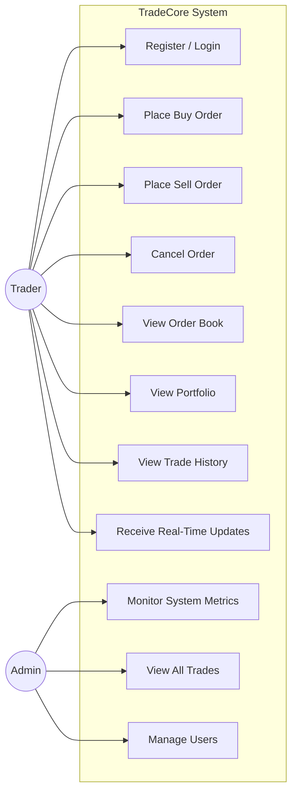

# TradeCore — Use Case Diagram

```mermaid
flowchart LR

%% Actors
Trader((Trader))
Admin((Admin))

%% System Boundary
subgraph TradeCore System

    UC1[Register / Login]
    UC2[Place Buy Order]
    UC3[Place Sell Order]
    UC4[Cancel Order]
    UC5[View Order Book]
    UC6[View Portfolio]
    UC7[View Trade History]
    UC8[Receive Real-Time Updates]

    UC9[Monitor System Metrics]
    UC10[View All Trades]
    UC11[Manage Users]

end

%% Trader Use Cases
Trader --> UC1
Trader --> UC2
Trader --> UC3
Trader --> UC4
Trader --> UC5
Trader --> UC6
Trader --> UC7
Trader --> UC8

%% Admin Use Cases
Admin --> UC9
Admin --> UC10
Admin --> UC11
```
